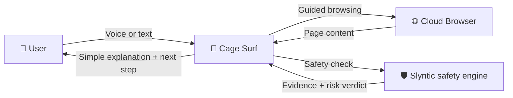

# Cage Surf

Cage Surf is a voice-first safe browsing assistant for older adults. It helps users navigate websites through natural conversation, explains confusing pages in simple language, and warns them before acting on suspicious messages, payment requests, fake support flows, or unsafe instructions.


##Product Direction

Older adults often face two problems online at the same time:
1. websites are difficult to navigate
2. scams and manipulative digital flows are increasingly dangerous

Cage Surf is designed to solve both. It combines conversational browsing with a built-in safety layer so users can get step-by-step help and scam-aware guidance in one place.

## Core Experience

- **Conversational browsing** — Ask for help by voice or text, and Cage Surf guides the task step by step
- **Simple page explanations** — Understand what a site is asking in calm, plain language
- **Built-in safety checks** — Analyze suspicious messages, payment requests, or instructions before acting
- **Voice support** — Speak to Cage Surf and hear responses read aloud
- **Senior-friendly UX** — Larger, calmer, more readable interface designed for clarity and confidence

## Safety Layer

Cage Surf now includes a dedicated safety engine powered by Slyntic.

This layer can:
- extract risky scam signals from text
- score suspicious claims and payment requests
- fetch supporting evidence with Firecrawl
- rank higher-trust evidence sources
- provide next-step guidance for risky situations
- speak safety guidance aloud using ElevenLabs

## How It Works



## Current Architecture

### Main App
- Cage Surf = browsing shell, guidance experience, voice/text interaction

### Internal Safety Engine
- Slyntic = trust verification, scam detection, evidence retrieval, safety guidance

## Tech Stack

- **Next.js 15** + React 19
- **Vercel AI SDK** + AI Gateway
- **Browser Use SDK** for cloud browser automation
- **ElevenLabs** for speech-to-text and text-to-speech
- **Firecrawl** for live evidence retrieval in safety checks
- **better-auth** for authentication
- **Prisma + PostgreSQL** for persistence
- **Upstash Redis** for session state
- **Tailwind CSS + shadcn/ui** for styling
- **tRPC** for typed API integration

## Current Implementation Status

Already implemented in the repo:
- safety module under `src/lib/safety/*`
- `POST /api/safety/analyze`
- browse home safety check card
- conversation-level safety warning banner
- first UI refactor toward senior-safe browsing

## Getting Started

### Prerequisites
- Node.js 18+
- pnpm
- PostgreSQL database

### Installation

```bash
git clone https://github.com/PranayHaldiya/cage-surf.git
cd cage-surf
pnpm install
cp .env.example .env
pnpm db:push
pnpm dev:local
```

Then open `http://localhost:3000`.

## Vision

Cage Surf should feel like a calm digital companion for older adults — not just a browser agent, and not just a scam checker. The goal is to make browsing easier, safer, and more understandable.
